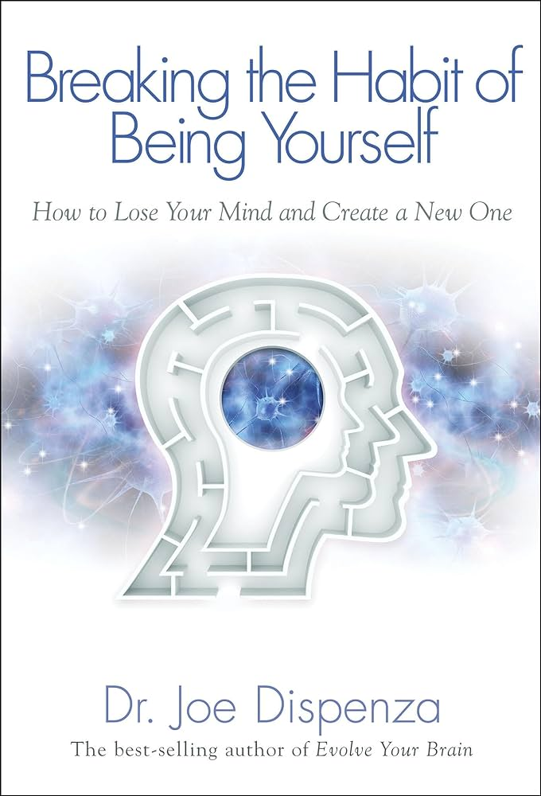

This page tracks books I have read & the book I am currently reading.
*=estimation of date finished

## Books Read

<table>
  <tr>
    <td><strong>Image</strong></td>
    <td><strong>Title</strong></td>
    <td><strong>Author</strong></td>
    <td><strong>Date Read</strong></td>
  </tr>
  <tr>
    <td></td>
    <td>Breaking The Habit of Being Yourself</td>
    <td>Dr. Joe Dispenza</td>
    <td>Current Read</td>
  </tr>
  <tr>
    <td></td>
    <td>The Kybalion</td>
    <td>The Three Initiates</td>
    <td>06/07/2024*</td>
  </tr>
  <tr>
    <td></td>
    <td>Media Sexploitation</td>
    <td>Wilson Bryan Key</td>
    <td>05/31/2024*</td>
  </tr>
  <tr>
    <td></td>
    <td>Willpower</td>
    <td>Roy Baumeister & John Tierney</td>
    <td>02/03/2024*</td>
  </tr>
  <tr>
    <td></td>
    <td>Seduction</td>
    <td>Robert Greene</td>
    <td>12/24/2023*</td>
  </tr>
  <tr>
    <td></td>
    <td>The 50th Law</td>
    <td>50 Cent & Robert Greene</td>
    <td>12/20/2023*</td>
  </tr>
  <tr>
    <td></td>
    <td>Percy Jackson And The Olympians: The Titan's Curse</td>
    <td>Rick Riordan</td>
    <td>12/18/2023*</td>
  </tr>
  <tr>
    <td></td>
    <td>Percy Jackson And The Olympians: The Sea of Monsters</td>
    <td>Rick Riordan</td>
    <td>12/05/2023*</td>
  </tr>
  <tr>
    <td></td>
    <td>Percy Jackson And The Olympains: The Lightning Thief</td>
    <td>Rick Riordan</td>
    <td>11/27/2023*</td>
  </tr>
  <tr>
    <td></td>
    <td>Harry Potter and The Deathly Hallows</td>
    <td>J.K. Rowling</td>
    <td>11/20/2023*</td>
  </tr>
  <tr>
    <td></td>
    <td>Harry Potter and The Half-Blood Prince</td>
    <td>J.K. Rowling</td>
    <td>11/10/2023*</td>
  </tr>
  <tr>
    <td></td>
    <td>The E-Myth Revisted</td>
    <td>Michael E. Gerber</td>
    <td>10/31/2023*</td>
  </tr>
  <tr>
    <td></td>
    <td>You Are A Badass</td>
    <td>Jen Sincero</td>
    <td>10/20/2023*</td>
  </tr>
  <tr>
    <td></td>
    <td>Harry Potter and The Order of The Phoenix</td>
    <td>J.K. Rowling</td>
    <td>10/01/2023*</td>
  </tr>
  <tr>
    <td></td>
    <td>The Concise Laws of Human Nature</td>
    <td>Robert Greene</td>
    <td>09/20/2023*</td>
  </tr>
  <tr>
    <td></td>
    <td>Harry Potter and The Goblet of Fire</td>
    <td>J.K. Rowling</td>
    <td>09/15/2023*</td>
  </tr>
  <tr>
    <td>Prisoner Of Azkaban.jpg</td>
    <td>Harry Potter and The Prisoner of Askaban</td>
    <td>J.K. Rowling</td>
    <td>08/31/2023*</td>
  </tr>
  <tr>
    <td></td>
    <td>Rich Dad Poor Dad</td>
    <td>Robert T. Kiyosaki</td>
    <td>08/17/2023*</td>
  </tr>
  <tr>
    <td></td>
    <td>The Millionaire Fastlane</td>
    <td>MJ DeMarco</td>
    <td>08/15/2023*</td>
  </tr>
  <tr>
    <td></td>
    <td>Harry Potter and The Chamber of Secrets</td>
    <td>J.K. Rowling</td>
    <td>08/10/2023*</td>
  </tr>
</table>
